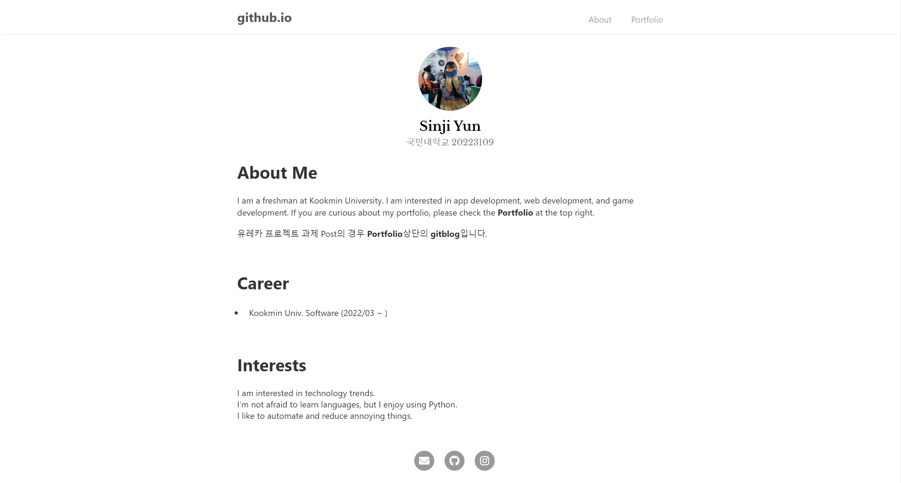
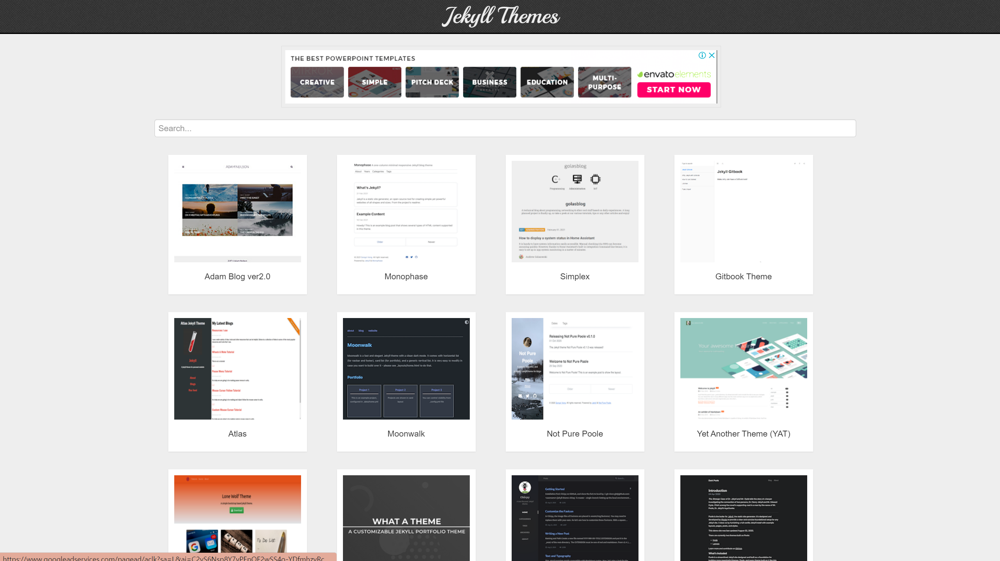
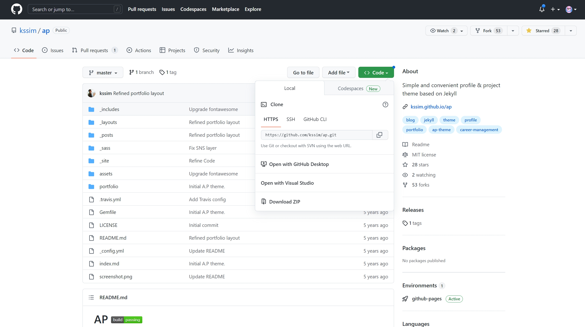

# [sinji2102.github.io](https://sinji2102.github.io/)



## Build 과정
### 1. Repository 생성
Github에서 \<username>.github.io 이름의 Repository 생성

### 2. Local-Remote Repository 연동
Remote Repository의 주소를 복사한 후  
`git clone <복사한 Remote Repository의 주소> <path>`로 clone  
`git commit -m "<commit msg>"`로 커밋 남기기  
`git branch -M main`으로 현재 branch의 이름을 main으로 변경  
`git status`로 현재 상태 확인 후 `git add .`로 변경파일 추가  
`git push origin main`으로 main에 로컬 변경사항 push  

### 3. Jekyll 설치
[Windows용 Jekyll 가이드 참조](https://jekyllrb-ko.github.io/docs/installation/windows/)

[Windows용 Ruby + Devkit](https://rubyinstaller.org/downloads/)  
위의 링크를 통해 Ruby 설치

Jekyll과 Bundler를 설치  
`gem install jekyll bundler`

Jekyll이 올바르게 설치되었는지 확인  
`jekyll -v`

### 4. Jekyll 사이트 생성
현재 디렉토리(.)에 Jekyll을 설치
`jekyll new . --force`

Jekyll 시작하기  
`bundle exec jekyll serve` 을 실행 후,  
localhost:4000 접속

* LoadError 발생 시 webrick 파일 설치
`bundle add webtick`

### 5. 테마 적용하기
- [다음](http://jekyllthemes.org/)에서 원하는 테마 선택


- [원하는 테마](https://github.com/kssim/ap)를 git clone해서 로컬에 받아오기


테마 파일들을 로컬 저장소에 반영하기  
이때, 의존성을 감안하여 _posts를 제외하고 테마를 덮어쓰기

### 6. Customize
블로그 포스팅은 ___posts__ 폴더에서 진행  
_post에 __YYYY-MM-DD-TITLE.md__ 형태로 새로운 문서를 작성
```
---
layout: post
title: "제목"
---
```
위와 같은 형식으로 Post 문서를 작성  
Markdown 형식을 통해 내용 작성
